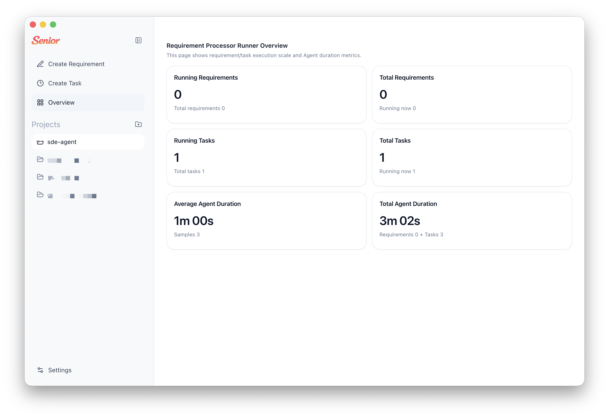
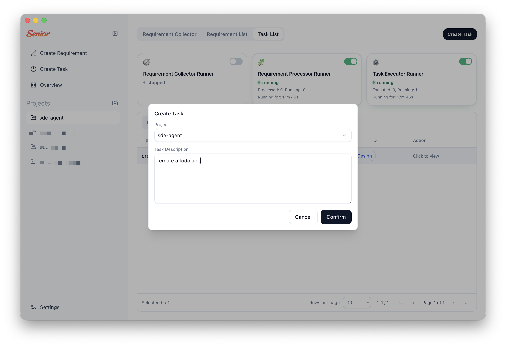
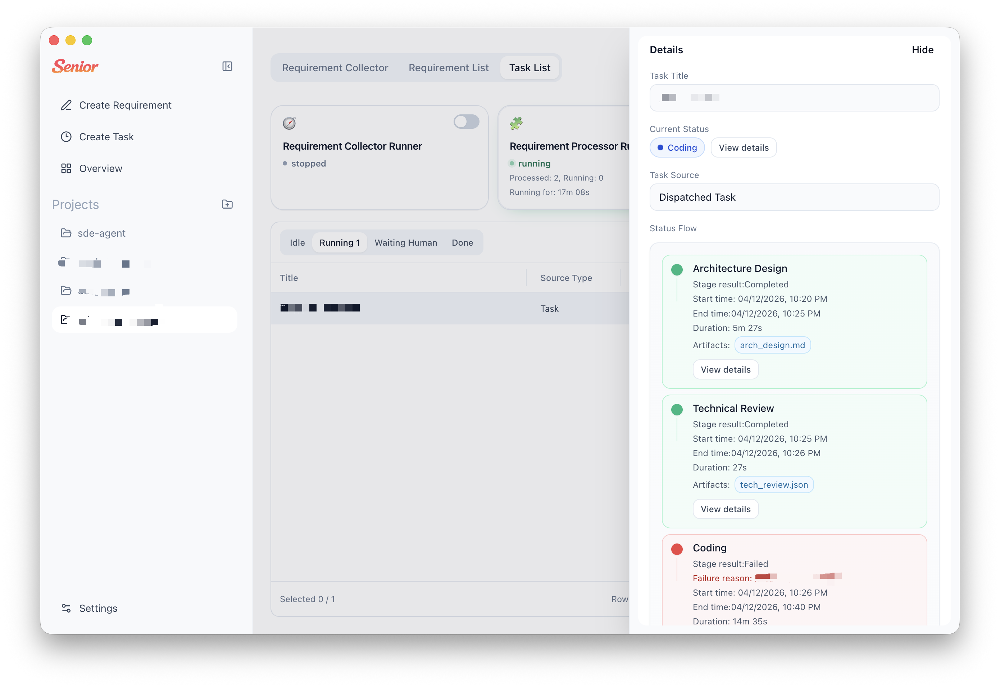
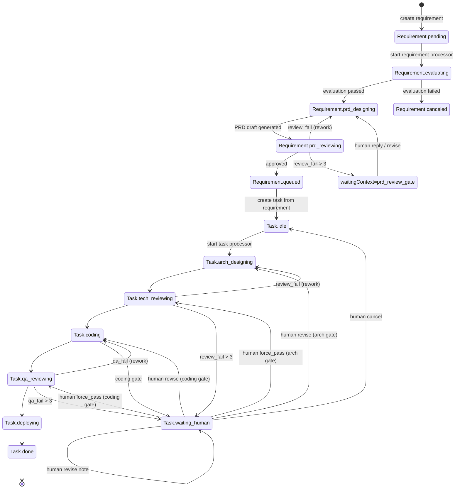

  

<div align="center">


# Senior

### Tu equipo de ingenieros senior disponible las 24 horas, los 7 días de la semana

### Un marco de agentes múltiples de IA para escritorio, diseñado para tareas de software a largo plazo

Senior es un marco de agentes múltiples de IA para escritorio construido con Electron que convierte la recopilación de requisitos en PRDs estructurados, y luego orquesta tareas de ingeniería a largo plazo mediante una ejecución por etapas de la IA con puntos de control humanos.

Desde la evaluación de requisitos hasta el diseño del PRD, la revisión técnica, la codificación, QA y las notas de despliegue, Senior mantiene cada etapa rastreable con artefactos e historial de ejecución.

[](#installation)
[](#how-it-works)
[](#data--artifacts)
[](#features)

[Installation](#installation) · [Quick Start](#quick-start) · [How It Works](#how-it-works) · [Contributing](#contributing)

[Contributing Guide](./CONTRIBUTING.md) · [Security Policy](./SECURITY.md)

**[Chino Simplificado](./docs/README.zh-CN.md)** | **[Chino Tradicional](./docs/README.zh-TW.md)** | **[Español](./docs/README.es.md)** | **[Alemán](./docs/README.de.md)** | **[Francés](./docs/README.fr.md)** | **[Japonés](./docs/README.ja.md)**

</div>

---

## Capturas de Pantalla

<div align="center">
  
  
  
</div>

---

## ¿Por qué Senior?

La mayoría de las herramientas de IA se detienen en el chat. Senior está diseñado como tu equipo de ingeniería siempre activo para la entrega de software a largo plazo, con máquinas de estado de flujo de trabajo explícitas:

- Los requisitos pasan por etapas explícitas: `pending -> evaluating -> prd_designing -> prd_reviewing -> queued/canceled`
- Las tareas pasan por etapas de entrega: `idle -> arch_designing -> tech_reviewing -> coding -> qa_reviewing -> deploying -> done`
- Cada etapa genera artefactos y mensajes de seguimiento para que los equipos puedan inspeccionar qué ocurrió en lugar de adivinar
- La intervención humana es de primera clase para los puntos de control de revisión y revisiones

Senior está diseñado para equipos que desean una ejecución de IA con control de procesos, no solo una interacción de prompt-respuesta.

---

## CaracterFuncionalidades

<table>
<tr>
<td width="50%">

### Flujo de Trabajo de Requisitos

Evalúa automáticamente la razonabilidad de los requisitos, genera borradores del PRD, revisa la calidad y pone en cola las tareas de entrega.

### Bucle de Orquestación de Tareas

Ejecuta el diseño de arquitectura, la revisión técnica, la codificación, la revisión de QA y la guía de despliegue como un flujo guiado por etapas.

### Puntos de Control con Humano en el Bucle

Cuando una etapa se detiene en el contexto de revisión, Senior se pausa y admite respuestas estructuradas por humanos antes de continuar.

</td>
<td width="50%">

### Seguimiento de Etapas y Línea de Tiempo

Inspecciona las ejecuciones por etapa (rondas, duraciones, estado) y los trazados detallados de agentes/herramientas para cada ejecución de etapa de tarea.

### Galería de Artefactos

Cada etapa persiste artefactos (por ejemplo `arch_design.md`, `tech_review.json`, `code.md`, `qa.json`, `deploy.md`).

### Almacenamiento Local-First

Los metadatos del proyecto, los estados de requisitos/tareas y las ejecuciones de etapas se almacenan en SQLite local con evolución de esquemas automática.

</td>
</tr>
</table>

### También Incluido

- **Procesadores automáticos duales** para los bucles de ejecución de requisitos y tareas
- **Vinculación del espacio de trabajo del proyecto** para que las ejecuciones de agentes se realicen contra los directorios de proyecto seleccionados
- **Interfaz bilingüe** (`en-US` y `zh-CN`) con persistencia de preferencias locales
- **Límite IPC de Electron** entre los servicios del renderer y el proceso principal

---

## Instalación

### Requisitos Previos

- Node.js 20+ (recomendado)
- npm 10+
- Un equipo con soporte de interfaz gráfica de escritorio (para Electron)
- Credenciales de tiempo de ejecución configuradas para al menos un SDK de Agente compatible:
  - Claude Agent SDK (predeterminado)
  - Codex SDK (SDK de Node; lee la configuración del proveedor desde `~/.codex/config.toml`, `OPENAI_API_KEY` opcional)

### Ejecutar desde el Código Fuente

```bash
git clone https://github.com/zhihuiio/senior.git
cd senior
npm install
npm run dev
```

### Compilar

```bash
npm run build
npm run preview
```

### Empaquetar DMG para macOS

```bash
npm run pack:dmg
```

Después de empaquetar, los artefactos del instalador se escriben en `release/`:

- `Senior-<version>-arm64.dmg`
- `Senior-<version>-arm64.zip`
- `Senior-<version>-arm64.dmg.blockmap`

### Distribución con Homebrew

Genera un archivo cask de Homebrew a partir del DMG empaquetado:

```bash
npm run homebrew:cask
```

Este comando crea `release/homebrew/senior.rb` con la `sha256` correcta y la plantilla de URL de lanzamiento.
Publica este archivo en tu repositorio de tap de Homebrew (por ejemplo `homebrew-tap/Casks/senior.rb`) después de cargar los assets de lanzamiento.

---

## Inicio Rápido

1. Inicia la aplicación con `npm run dev`.
2. Crea o selecciona un directorio de proyecto.
3. Añade requisitos en el espacio de trabajo.
4. Inicia el Procesador Automático de Requisitos para evaluar y redactar PRDs.
5. Revisa las tareas en cola e inicia el Procesador Automático de Tareas.
6. Inspecciona los seguados de etapa y artefactos, y proporciona retroalimentación humana cuando un punto de control detiene la ejecución.

Consejo: también puedes orquestar tareas específicas manualmente y responder directamente en los flujos de conversación humana de tareas.

---

## Cómo Funciona

```text
┌─────────────────────────────────────────────────────────────────────┐
│                           Senior Desktop                            │
│  ┌───────────────┐   IPC   ┌─────────────────────────────────────┐  │
│  │ React Renderer│◄───────►│ Electron Main Services             │  │
│  │ (UI + State)  │         │ - project/requirement/task service │  │
│  └───────────────┘         │ - auto processors                  │  │
│                            │ - stage run + trace management     │  │
│                            └───────────────┬─────────────────────┘  │
│                                            │                        │
│                            ┌───────────────▼─────────────────────┐  │
│                            │ Agent SDK Strategy Layer            │  │
│                            │ - Claude Agent SDK (default)        │  │
│                            │ - Codex SDK                         │  │
│                            └───────────────┬─────────────────────┘  │
│                                            │                        │
│                ┌───────────────────────────▼─────────────────────┐  │
│                │ Local data                                      │  │
│                │ - SQLite app.db (Electron userData)            │  │
│                │ - .senior/tasks/<taskId> artifacts              │  │
│                └─────────────────────────────────────────────────┘  │
└─────────────────────────────────────────────────────────────────────┘
```

### Máquina de Estados de Requisitos a Tareas



---

## Estructura del Proyecto

```text
src/
  main/                 Electron main process, services, DB, agents
  preload/              Secure API bridge for renderer
  renderer/             React UI, hooks, i18n, components
  shared/               Shared types and IPC contracts
tests/
  main/agents/          Agent behavior tests
resources/
  senior_v2.png         Project image asset
```

---

## Scripts

```bash
npm run dev                  # Start Electron + Vite in development
npm run build                # Build main/preload/renderer bundles
npm run pack:dmg             # Build and package macOS DMG artifacts
npm run pack:mac             # Build and package all configured macOS targets
npm run release:mac          # Build and publish macOS release artifacts
npm run homebrew:cask        # Generate Homebrew cask file from packaged DMG
npm run preview              # Preview built app
npm run test:freeform-agent  # Run freeform agent tests
```

`npm install` also triggers `electron-rebuild -f -w better-sqlite3` via `postinstall`.

---

## Datos y Artefactos

- Archivo de base de datos SQLite: `<electron-userData>/app.db`
- Directorio de artefactos de tareas: `<project-path>/.senior/tasks/<taskId>/`
- Los artefactos de etapa comúnmente incluyen:
  - `arch_design.md`
  - `tech_review.json`
  - `code.md`
  - `qa.json`
  - `deploy.md`

Senior almacena el estado de ejecución de la etapa (`running/succeeded/failed/waiting_human`), metadatos de ronda y trazados de agente, para que las ejecuciones interrumpidas puedan repararse y reanudarse de forma segura.

---

## Hoja de Ruta

- [x] Pipeline de la etapa de requisitos (evaluación, diseño de PRD, revisión)
- [x] Orquestación de la etapa de tareas con puntos de control de revisión
- [x] Procesadores automáticos de requisitos y tareas
- [x] Persistencia de seguimiento de ejecución de etapas y visualización de línea de tiempo
- [x] Lectura de artefactos desde directorios de tareas del espacio de trabajo
- [x] Flujo de trabajo de DMG empaquetado para macOS y generación de cask de Homebrew
- [ ] Cubrimiento de pruebas expandido más allá de las pruebas de agentes en formato libre
- [ ] Más idiomas de la interfaz además de inglés y chino simplificado

---

## Contribuir

Se aceptan contribuciones, especialmente en estas áreas:

- Fiabilidad del flujo de trabajo y manejo de casos límite
- Pruebas y fijaciones adicionales
- Mejoras en la interfaz de usuario/experiencia de usuario para la trazabilidad y el control del operador
- Internacionalización y calidad de la documentación

Inicio del desarrollo:

```bash
npm install
npm run dev
```

---

## Licencia

Este proyecto está licenciado bajo la Licencia Comunitaria Senior. Consulta `LICENSE` para obtener más detalles.
