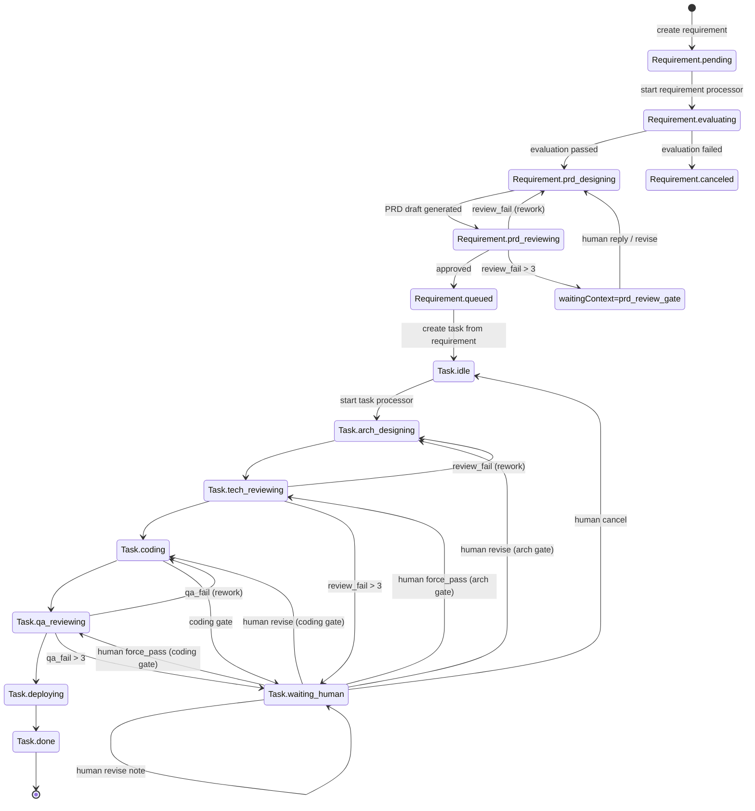

<div align="center">


# Senior

### Your 24/7 team of senior engineers

### A desktop AI multi-agent harness built for long-horizon software tasks

Senior is an Electron desktop AI multi-agent harness that turns requirement intake into structured PRDs, then orchestrates long-horizon engineering tasks through staged AI execution with human gates.

From requirement evaluation to PRD design, technical review, coding, QA, and deployment notes, Senior keeps every stage traceable with artifacts and run history.

[](#installation)
[](#how-it-works)
[](#data--artifacts)
[](#features)

[Installation](#installation) · [Quick Start](#quick-start) · [How It Works](#how-it-works) · [Contributing](#contributing)

[Contributing Guide](./CONTRIBUTING.md) · [Security Policy](./SECURITY.md)

**[简体中文](./docs/README.zh-CN.md)** | **[繁體中文](./docs/README.zh-TW.md)** | **[Español](./docs/README.es.md)** | **[Deutsch](./docs/README.de.md)** | **[Français](./docs/README.fr.md)** | **[日本語](./docs/README.ja.md)**

</div>

---

<div align="center">


</div>

---

## Screenshots

<div align="center">
  
  
  
</div>

---

## Why Senior?

Most AI tooling stops at chat. Senior is designed as your always-on engineering team for long-horizon software delivery, with explicit workflow state machines:

- Requirements move through explicit stages: `pending -> evaluating -> prd_designing -> prd_reviewing -> queued/canceled`
- Tasks move through delivery stages: `idle -> arch_designing -> tech_reviewing -> coding -> qa_reviewing -> deploying -> done`
- Every stage writes artifacts and trace messages so teams can inspect what happened instead of guessing
- Human intervention is first-class for review gates and revisions

Senior is built for teams that want AI execution with process control, not just prompt-response interaction.

---

## Features

<table>
<tr>
<td width="50%">

### Requirement Pipeline
Automatically evaluate requirement reasonability, generate PRD drafts, review quality, and enqueue deliverable tasks.

### Task Orchestration Loop
Run architecture design, technical review, coding, QA review, and deployment guidance as a stage-driven flow.

### Human-in-the-Loop Gates
When a stage blocks on review context, Senior pauses and supports structured human replies before continuing.

</td>
<td width="50%">

### Stage Trace & Timeline
Inspect per-stage runs (rounds, durations, status) and detailed agent/tool traces for each task stage run.

### Artifact Rail
Each stage persists artifacts (for example `arch_design.md`, `tech_review.json`, `code.md`, `qa.json`, `deploy.md`).

### Local-First Storage
Project metadata, requirement/task states, and stage runs are stored in local SQLite with automatic schema evolution.

</td>
</tr>
</table>

### Also Included

- **Dual auto processors** for requirement and task execution loops
- **Project workspace binding** so agent runs are executed against selected project directories
- **Bilingual UI** (`en-US` and `zh-CN`) with local preference persistence
- **Electron IPC boundary** between renderer and main process services

---

## Installation

### Prerequisites

- Node.js 20+ (recommended)
- npm 10+
- A machine with desktop GUI support (for Electron)
- Claude Agent SDK runtime credentials configured in your local environment

### Run from Source

```bash
git clone https://github.com/zhihuiio/senior.git
cd senior
npm install
npm run dev
```

### Build

```bash
npm run build
npm run preview
```

---

## Quick Start

1. Launch the app with `npm run dev`.
2. Create or select a project directory.
3. Add requirements in the workspace.
4. Start the Requirement Auto Processor to evaluate and draft PRDs.
5. Review queued tasks and start the Task Auto Processor.
6. Inspect stage traces and artifacts, then provide human feedback when a gate pauses execution.

Tip: you can also manually orchestrate specific tasks and reply directly in task human-conversation flows.

---

## How It Works

```text
┌─────────────────────────────────────────────────────────────────────┐
│                           Senior Desktop                            │
│  ┌───────────────┐   IPC   ┌─────────────────────────────────────┐  │
│  │ React Renderer│◄───────►│ Electron Main Services             │  │
│  │ (UI + State)  │         │ - project/requirement/task service │  │
│  └───────────────┘         │ - auto processors                  │  │
│                            │ - stage run + trace management     │  │
│                            └───────────────┬─────────────────────┘  │
│                                            │                        │
│                            ┌───────────────▼─────────────────────┐  │
│                            │ Claude Agent SDK                    │  │
│                            │ - requirement agents                │  │
│                            │ - task stage agents                 │  │
│                            └───────────────┬─────────────────────┘  │
│                                            │                        │
│                ┌───────────────────────────▼─────────────────────┐  │
│                │ Local data                                      │  │
│                │ - SQLite app.db (Electron userData)            │  │
│                │ - .senior/tasks/<taskId> artifacts              │  │
│                └─────────────────────────────────────────────────┘  │
└─────────────────────────────────────────────────────────────────────┘
```

### Requirement-to-Task State Machine



---

## Project Structure

```text
src/
  main/                 Electron main process, services, DB, agents
  preload/              Secure API bridge for renderer
  renderer/             React UI, hooks, i18n, components
  shared/               Shared types and IPC contracts
tests/
  main/agents/          Agent behavior tests
resources/
  senior_v2.png         Project image asset
```

---

## Scripts

```bash
npm run dev                  # Start Electron + Vite in development
npm run build                # Build main/preload/renderer bundles
npm run preview              # Preview built app
npm run test:freeform-agent  # Run freeform agent tests
```

`npm install` also triggers `electron-rebuild -f -w better-sqlite3` via `postinstall`.

---

## Data & Artifacts

- SQLite database file: `<electron-userData>/app.db`
- Task artifacts directory: `<project-path>/.senior/tasks/<taskId>/`
- Stage artifacts commonly include:
  - `arch_design.md`
  - `tech_review.json`
  - `code.md`
  - `qa.json`
  - `deploy.md`

Senior stores stage run status (`running/succeeded/failed/waiting_human`), round metadata, and agent traces so interrupted runs can be repaired and resumed safely.

---

## Roadmap

- [x] Requirement stage pipeline (evaluation, PRD design, review)
- [x] Task stage orchestration with review gates
- [x] Requirement and task auto processors
- [x] Stage run trace persistence and timeline visualization
- [x] Artifact reading from workspace task directories
- [ ] Expanded test coverage beyond freeform agent tests
- [ ] Packaged release workflow and installer artifacts
- [ ] More UI languages beyond English and Simplified Chinese

---

## Contributing

Contributions are welcome, especially in these areas:

- Workflow reliability and edge-case handling
- Additional tests and fixtures
- UI/UX improvements for traceability and operator control
- Internationalization and docs quality

Development bootstrap:

```bash
npm install
npm run dev
```

---

## License

This project is licensed under the Senior Community License. See `LICENSE` for details.
