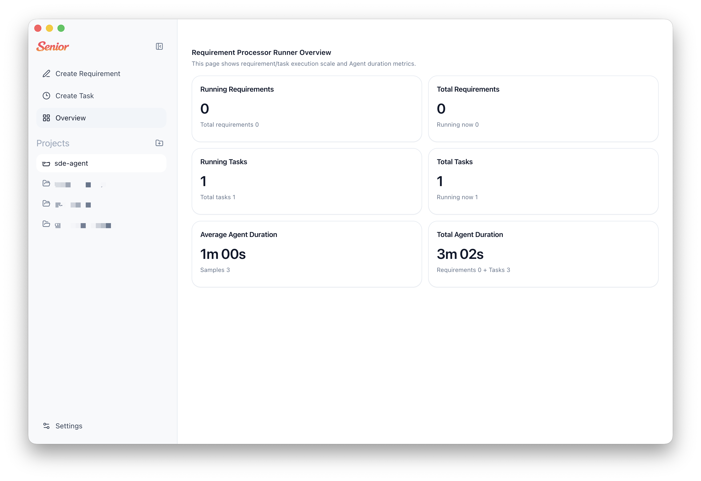
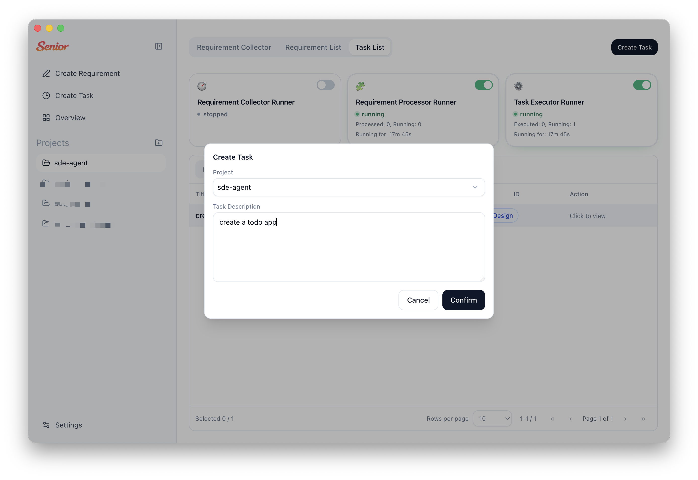
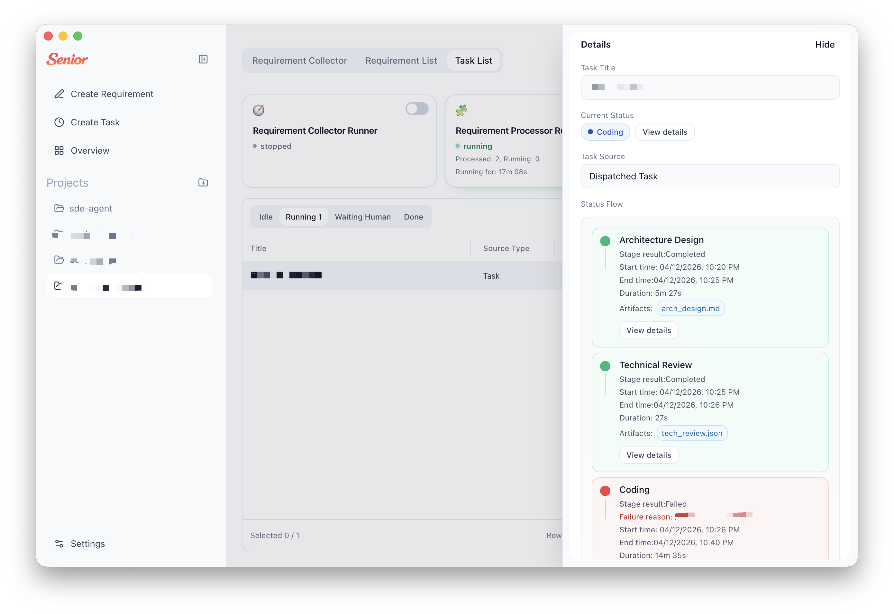
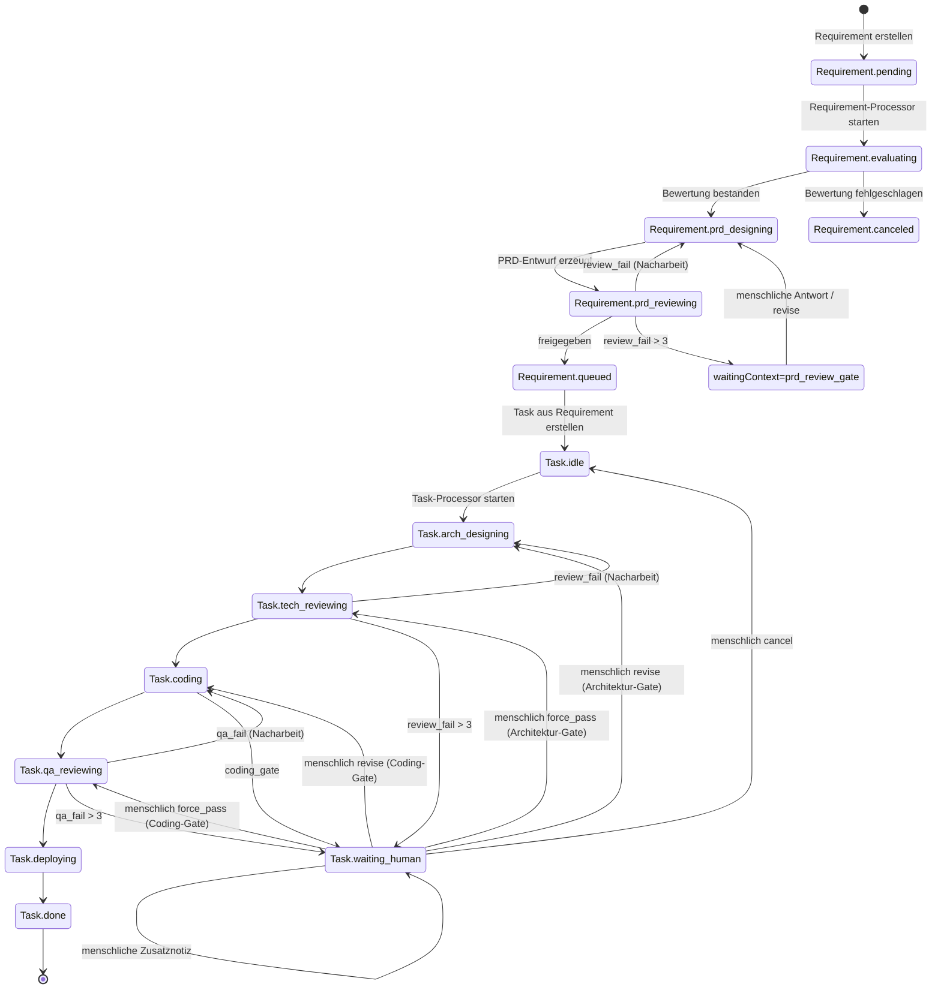

<div align="center">


# Senior

### Dein 24/7-Team aus Senior Engineers

### Ein Desktop-AI-Multi-Agent-Harness für langfristige Softwareaufgaben

Senior ist ein Electron-basiertes Desktop-AI-Multi-Agent-Harness, das Requirement Intake in strukturierte PRDs überführt und anschließend langfristige Engineering-Aufgaben über stufenbasierte AI-Ausführung mit Human Gates orchestriert.

Von Anforderungsbewertung über PRD-Design, technisches Review, Coding, QA bis zu Deployment-Hinweisen hält Senior jede Phase mit Artefakten und Laufhistorie nachvollziehbar.

[](#installation)
[](#funktionsweise)
[](#daten--artefakte)
[](#funktionen)

[Installation](#installation) · [Schnellstart](#schnellstart) · [Funktionsweise](#funktionsweise) · [Beitragen](#beitragen)

[Beitragsleitfaden](../CONTRIBUTING.md) · [Sicherheitsrichtlinie](../SECURITY.md)

**[English](../README.md)** | **[简体中文](./README.zh-CN.md)** | **[繁體中文](./README.zh-TW.md)** | **[Español](./README.es.md)** | **[Français](./README.fr.md)** | **[日本語](./README.ja.md)**

</div>

## Screenshots

<div align="center">
  
  
  
</div>

---

## Warum Senior?

Viele AI-Tools enden beim Chat. Senior ist als dein jederzeit verfügbares Engineering-Team für langfristige Software-Delivery ausgelegt, mit expliziten Workflow-Statusmaschinen:

- Anforderungen durchlaufen explizite Zustände: `pending -> evaluating -> prd_designing -> prd_reviewing -> queued/canceled`
- Aufgaben durchlaufen Delivery-Phasen: `idle -> arch_designing -> tech_reviewing -> coding -> qa_reviewing -> deploying -> done`
- Jede Phase schreibt Artefakte und Traces, damit Teams nachvollziehen können, was passiert ist
- Menschliche Eingriffe sind erstklassig für Review-Gates und Revisionen

Senior ist für Teams gebaut, die AI-Ausführung mit Prozesskontrolle brauchen, nicht nur Prompt-Response-Interaktion.

---

## Funktionen

<table>
<tr>
<td width="50%">

### Requirement-Pipeline

Automatische Bewertung der Plausibilität, Erstellung von PRD-Entwürfen, Qualitätsreview und Queueing ausführbarer Tasks.

### Task-Orchestrierungsloop

Ausführung von Architekturdesign, technischem Review, Coding, QA-Review und Deployment-Hinweisen als stage-getriebener Flow.

### Human-in-the-Loop Gates

Wenn eine Phase menschlichen Kontext benötigt, pausiert Senior und setzt nach strukturierter Antwort fort.

</td>
<td width="50%">

### Stage-Trace & Timeline

Inspektion pro Stage-Run (Runden, Dauer, Status) sowie detaillierter Agent/Tool-Traces je Task-Stage-Run.

### Artefakt-Leiste

Jede Stage persistiert Artefakte (z. B. `arch_design.md`, `tech_review.json`, `code.md`, `qa.json`, `deploy.md`).

### Local-First Storage

Projektmetadaten, Requirement/Task-States und Stage-Runs liegen in lokaler SQLite mit automatischer Schema-Evolution.

</td>
</tr>
</table>

### Zusätzlich enthalten

- **Duale Auto-Processor** für Requirement- und Task-Ausführungsloops
- **Workspace-Bindung** für Agent-Runs in ausgewählten Projektverzeichnissen
- **Zweisprachige UI** (`en-US` und `zh-CN`) mit lokaler Persistenz
- **Electron-IPC-Grenze** zwischen Renderer und Main-Process-Services

---

## Installation

### Voraussetzungen

- Node.js 20+ (empfohlen)
- npm 10+
- Rechner mit Desktop-GUI (für Electron)
- Lokal konfigurierte Runtime-Credentials für Claude Agent SDK

### Aus dem Quellcode starten

```bash
git clone https://github.com/zhihuiio/senior.git
cd senior
npm install
npm run dev
```

### Build

```bash
npm run build
npm run preview
```

---

## Schnellstart

1. App mit `npm run dev` starten.
2. Projektverzeichnis erstellen oder auswählen.
3. Anforderungen im Workspace anlegen.
4. Requirement Auto Processor starten, um Anforderungen zu bewerten und PRDs zu erzeugen.
5. Queue-Aufgaben prüfen und Task Auto Processor starten.
6. Stage-Traces und Artefakte prüfen; bei Gate-Pausen menschliches Feedback geben.

Tipp: Einzelne Tasks können auch manuell orchestriert und über Task-Human-Conversations beantwortet werden.

---

## Funktionsweise

```text
┌─────────────────────────────────────────────────────────────────────┐
│                           Senior Desktop                            │
│  ┌───────────────┐   IPC   ┌─────────────────────────────────────┐  │
│  │ React Renderer│◄───────►│ Electron Main Services             │  │
│  │ (UI + State)  │         │ - project/requirement/task service │  │
│  └───────────────┘         │ - auto processors                  │  │
│                            │ - stage run + trace management     │  │
│                            └───────────────┬─────────────────────┘  │
│                                            │                        │
│                            ┌───────────────▼─────────────────────┐  │
│                            │ Claude Agent SDK                    │  │
│                            │ - requirement agents                │  │
│                            │ - task stage agents                 │  │
│                            └───────────────┬─────────────────────┘  │
│                                            │                        │
│                ┌───────────────────────────▼─────────────────────┐  │
│                │ Local data                                      │  │
│                │ - SQLite app.db (Electron userData)            │  │
│                │ - .senior/tasks/<taskId> artifacts              │  │
│                └─────────────────────────────────────────────────┘  │
└─────────────────────────────────────────────────────────────────────┘
```

### State Machine von Requirement zu Task



---

## Projektstruktur

```text
src/
  main/                 Electron-Main-Process, Services, DB, Agents
  preload/              Sichere API-Brücke für Renderer
  renderer/             React-UI, Hooks, i18n, Komponenten
  shared/               Gemeinsame Typen und IPC-Verträge
tests/
  main/agents/          Agent-Verhaltenstests
resources/
  senior_v2.png         Projektbild
```

---

## Skripte

```bash
npm run dev                  # Electron + Vite im Entwicklungsmodus starten
npm run build                # Main/Preload/Renderer-Bundles bauen
npm run preview              # Gebaute App prüfen
npm run test:freeform-agent  # Freeform-Agent-Tests ausführen
```

`npm install` triggert zusätzlich `electron-rebuild -f -w better-sqlite3` via `postinstall`.

---

## Daten & Artefakte

- SQLite-Datei: `<electron-userData>/app.db`
- Task-Artefaktordner: `<project-path>/.senior/tasks/<taskId>/`
- Typische Stage-Artefakte:
  - `arch_design.md`
  - `tech_review.json`
  - `code.md`
  - `qa.json`
  - `deploy.md`

Senior speichert Stage-Run-Status (`running/succeeded/failed/waiting_human`), Rundenmetadaten und Agent-Traces, damit unterbrochene Läufe sicher repariert und fortgesetzt werden können.

---

## Roadmap

- [x] Requirement-Stage-Pipeline (Evaluation, PRD-Design, Review)
- [x] Task-Stage-Orchestrierung mit Review-Gates
- [x] Requirement- und Task-Auto-Processor
- [x] Persistente Stage-Traces und Timeline-Visualisierung
- [x] Artefaktzugriff aus Workspace-Task-Verzeichnissen
- [ ] Erweiterte Testabdeckung über Freeform-Agent hinaus
- [ ] Paketierte Release- und Installer-Workflows
- [ ] Mehr UI-Sprachen über Englisch und vereinfachtes Chinesisch hinaus

---

## Beitragen

Beiträge sind willkommen, besonders in diesen Bereichen:

- Workflow-Robustheit und Edge-Case-Handling
- Zusätzliche Tests und Fixtures
- UI/UX-Verbesserungen für Nachvollziehbarkeit und Betriebskontrolle
- Internationalisierung und Dokumentationsqualität

Development-Setup:

```bash
npm install
npm run dev
```

---

## Lizenz

Dieses Projekt steht unter der Senior Community License. Details siehe `LICENSE`.
