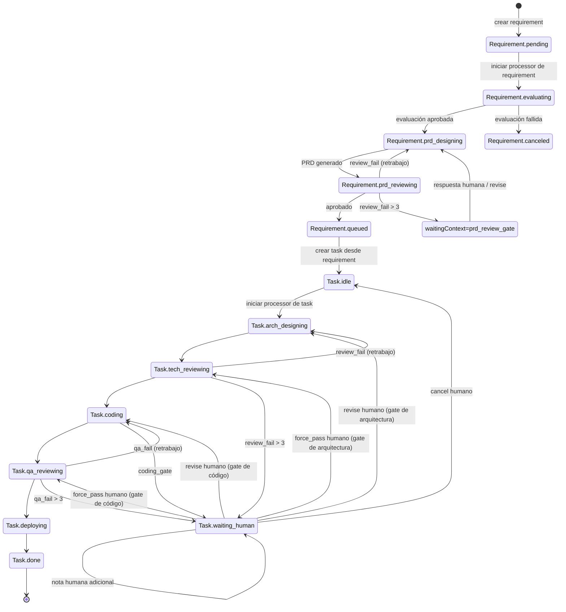

<div align="center">


# Senior

### Tu equipo 24/7 de ingenieros senior

### Un harness de IA multiagente de escritorio para tareas de software de largo horizonte

Senior es un harness de IA multiagente sobre Electron que transforma la captura de requisitos en PRDs estructurados y luego orquesta tareas de ingeniería de largo horizonte con ejecución IA por etapas y compuertas humanas.

Desde evaluación de requisitos hasta diseño de PRD, revisión técnica, codificación, QA y notas de despliegue, Senior mantiene cada etapa trazable con artefactos e historial de ejecución.

[](#instalación)
[](#cómo-funciona)
[](#datos-y-artefactos)
[](#características)

[Instalación](#instalación) · [Inicio rápido](#inicio-rápido) · [Cómo funciona](#cómo-funciona) · [Contribuir](#contribuir)

**[English](../README.md)** | **[简体中文](./README.zh-CN.md)** | **[繁體中文](./README.zh-TW.md)** | **[Deutsch](./README.de.md)** | **[Français](./README.fr.md)** | **[日本語](./README.ja.md)**

</div>

---

<div align="center">


</div>

---

## Capturas de pantalla

<div align="center">
  
  
  
</div>

---

## ¿Por qué Senior?

La mayoría de herramientas de IA se quedan en chat. Senior está diseñado como tu equipo de ingeniería siempre activo para entregas de software de largo horizonte, con máquinas de estado de flujo explícitas:

- Los requisitos avanzan por estados explícitos: `pending -> evaluating -> prd_designing -> prd_reviewing -> queued/canceled`
- Las tareas avanzan por etapas de entrega: `idle -> arch_designing -> tech_reviewing -> coding -> qa_reviewing -> deploying -> done`
- Cada etapa escribe artefactos y trazas para inspeccionar qué ocurrió realmente
- La intervención humana es de primera clase en compuertas de revisión y revisiones

Senior está pensado para equipos que necesitan ejecución con IA y control de proceso, no solo interacción prompt-respuesta.

---

## Características

<table>
<tr>
<td width="50%">

### Pipeline de requisitos
Evalúa automáticamente la razonabilidad del requisito, genera borradores PRD, revisa calidad y encola tareas ejecutables.

### Bucle de orquestación de tareas
Ejecuta diseño de arquitectura, revisión técnica, codificación, revisión QA y guía de despliegue como flujo por etapas.

### Compuertas Human-in-the-Loop
Cuando una etapa requiere contexto humano, Senior pausa y admite respuestas estructuradas antes de continuar.

</td>
<td width="50%">

### Trazas y línea de tiempo por etapa
Inspecciona runs por etapa (rondas, duración, estado) y trazas detalladas de agente/herramientas para cada run.

### Carril de artefactos
Cada etapa persiste artefactos (por ejemplo `arch_design.md`, `tech_review.json`, `code.md`, `qa.json`, `deploy.md`).

### Almacenamiento local-first
Metadatos de proyecto, estados de requisitos/tareas y runs de etapa se guardan en SQLite local con evolución automática de esquema.

</td>
</tr>
</table>

### También incluye

- **Procesadores automáticos duales** para bucles de requisitos y tareas
- **Ejecución ligada al workspace** para correr agentes en directorios de proyecto seleccionados
- **UI bilingüe** (`en-US` y `zh-CN`) con preferencia persistida localmente
- **Límite IPC de Electron** entre renderer y servicios del proceso principal

---

## Instalación

### Requisitos previos

- Node.js 20+ (recomendado)
- npm 10+
- Máquina con entorno gráfico (Electron)
- Credenciales del runtime de Claude Agent SDK configuradas localmente

### Ejecutar desde código fuente

```bash
git clone https://github.com/zhihuiio/senior.git
cd senior
npm install
npm run dev
```

### Build

```bash
npm run build
npm run preview
```

---

## Inicio rápido

1. Inicia la app con `npm run dev`.
2. Crea o selecciona un directorio de proyecto.
3. Agrega requisitos en el workspace.
4. Inicia Requirement Auto Processor para evaluar y generar PRDs.
5. Revisa tareas en cola e inicia Task Auto Processor.
6. Inspecciona trazas y artefactos; aporta feedback humano cuando una compuerta pause la ejecución.

Consejo: también puedes orquestar tareas específicas manualmente y responder en los flujos de conversación humana de tareas.

---

## Cómo funciona

```text
┌─────────────────────────────────────────────────────────────────────┐
│                           Senior Desktop                            │
│  ┌───────────────┐   IPC   ┌─────────────────────────────────────┐  │
│  │ React Renderer│◄───────►│ Electron Main Services             │  │
│  │ (UI + State)  │         │ - project/requirement/task service │  │
│  └───────────────┘         │ - auto processors                  │  │
│                            │ - stage run + trace management     │  │
│                            └───────────────┬─────────────────────┘  │
│                                            │                        │
│                            ┌───────────────▼─────────────────────┐  │
│                            │ Claude Agent SDK                    │  │
│                            │ - requirement agents                │  │
│                            │ - task stage agents                 │  │
│                            └───────────────┬─────────────────────┘  │
│                                            │                        │
│                ┌───────────────────────────▼─────────────────────┐  │
│                │ Local data                                      │  │
│                │ - SQLite app.db (Electron userData)            │  │
│                │ - .senior/tasks/<taskId> artifacts              │  │
│                └─────────────────────────────────────────────────┘  │
└─────────────────────────────────────────────────────────────────────┘
```

### Máquina de estados de Requirement a Task



---

## Estructura del proyecto

```text
src/
  main/                 Proceso principal Electron, servicios, DB, agents
  preload/              Puente API seguro para renderer
  renderer/             UI React, hooks, i18n, componentes
  shared/               Tipos compartidos y contratos IPC
tests/
  main/agents/          Tests de comportamiento de agents
resources/
  senior_v2.png         Recurso de imagen del proyecto
```

---

## Scripts

```bash
npm run dev                  # Inicia Electron + Vite en desarrollo
npm run build                # Compila bundles main/preload/renderer
npm run preview              # Previsualiza la app compilada
npm run test:freeform-agent  # Ejecuta tests de freeform agent
```

`npm install` también ejecuta `electron-rebuild -f -w better-sqlite3` vía `postinstall`.

---

## Datos y artefactos

- Base SQLite: `<electron-userData>/app.db`
- Directorio de artefactos de tarea: `<project-path>/.senior/tasks/<taskId>/`
- Artefactos típicos por etapa:
  - `arch_design.md`
  - `tech_review.json`
  - `code.md`
  - `qa.json`
  - `deploy.md`

Senior guarda estado de runs de etapa (`running/succeeded/failed/waiting_human`), metadatos de ronda y trazas de agente para reparar y reanudar ejecuciones interrumpidas de forma segura.

---

## Roadmap

- [x] Pipeline de etapas de requisitos (evaluación, diseño PRD, revisión)
- [x] Orquestación de etapas de tareas con compuertas de revisión
- [x] Procesadores automáticos de requisitos y tareas
- [x] Persistencia de trazas de etapa y visualización en timeline
- [x] Lectura de artefactos desde directorios de tarea
- [ ] Cobertura de tests más allá de freeform agent
- [ ] Flujo de releases empaquetados e instaladores
- [ ] Más idiomas de UI además de inglés y chino simplificado

---

## Contribuir

Se aceptan contribuciones, especialmente en:

- Fiabilidad del workflow y manejo de casos límite
- Tests adicionales y fixtures
- Mejoras UI/UX para trazabilidad y control operativo
- Internacionalización y calidad de documentación

Bootstrap de desarrollo:

```bash
npm install
npm run dev
```

---

## Licencia

Este proyecto está licenciado bajo la Senior Community License. Consulta `LICENSE` para más detalles.
