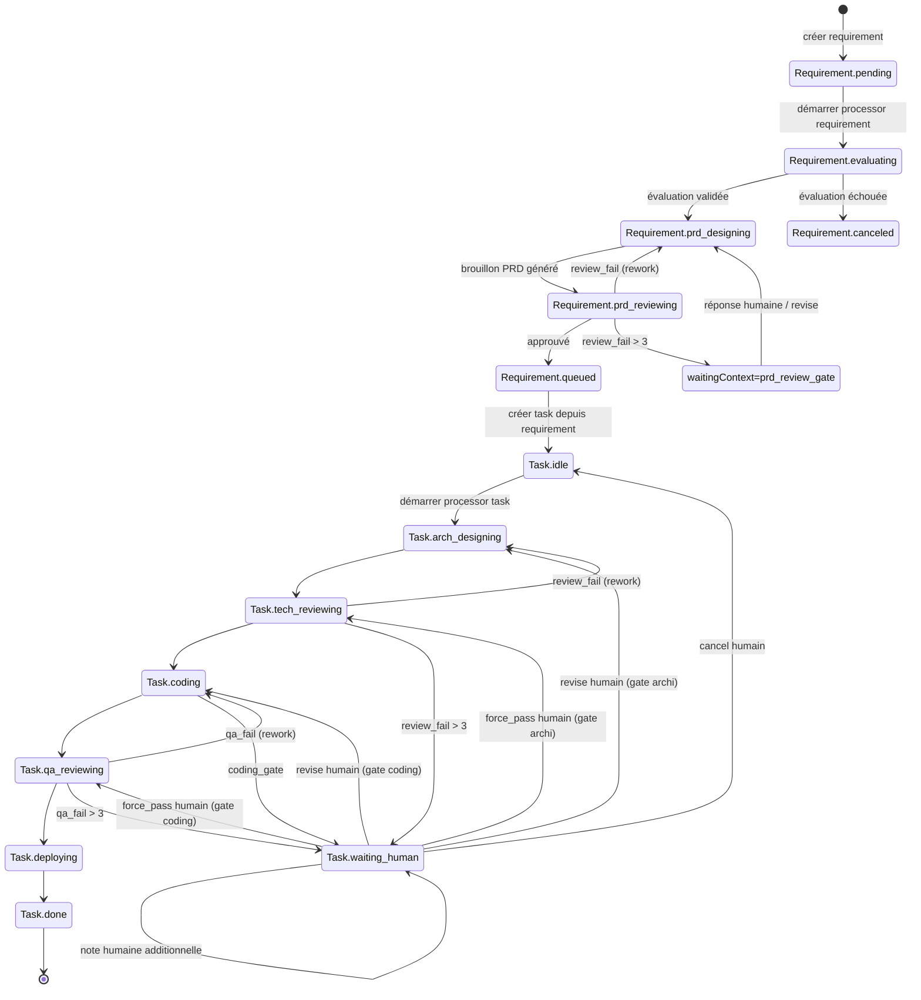

<div align="center">


# Senior

### Votre équipe 24/7 d’ingénieurs senior

### Un harness IA multi-agent desktop conçu pour les tâches logicielles de long horizon

Senior est un harness IA multi-agent desktop basé sur Electron qui transforme la collecte d’exigences en PRD structurés, puis orchestre les tâches d’ingénierie de long horizon via une exécution IA par étapes avec validations humaines.

De l’évaluation d’exigences à la conception PRD, revue technique, développement, QA et notes de déploiement, Senior rend chaque étape traçable grâce aux artefacts et à l’historique d’exécution.

[](#installation)
[](#fonctionnement)
[](#données--artefacts)
[](#fonctionnalités)

[Installation](#installation) · [Démarrage rapide](#démarrage-rapide) · [Fonctionnement](#fonctionnement) · [Contribuer](#contribuer)

**[English](../README.md)** | **[简体中文](./README.zh-CN.md)** | **[繁體中文](./README.zh-TW.md)** | **[Español](./README.es.md)** | **[Deutsch](./README.de.md)** | **[日本語](./README.ja.md)**

</div>

---

<div align="center">


</div>

---

## Captures d’écran

<div align="center">
  
  
  
</div>

---

## Pourquoi Senior ?

La plupart des outils IA s’arrêtent au chat. Senior est conçu comme votre équipe d’ingénierie toujours active pour des livraisons logicielles de long horizon, avec des workflows pilotés par états explicites :

- Les exigences suivent des états explicites : `pending -> evaluating -> prd_designing -> prd_reviewing -> queued/canceled`
- Les tâches suivent des étapes de delivery : `idle -> arch_designing -> tech_reviewing -> coding -> qa_reviewing -> deploying -> done`
- Chaque étape génère artefacts et traces, pour comprendre exactement ce qui s’est passé
- L’intervention humaine est native pour les gates de revue et les révisions

Senior est conçu pour les équipes qui veulent l’exécution IA avec contrôle de processus, pas seulement des échanges prompt-réponse.

---

## Fonctionnalités

<table>
<tr>
<td width="50%">

### Pipeline d’exigences
Évalue automatiquement la pertinence d’une exigence, génère des brouillons PRD, effectue la revue qualité et met en file les tâches exécutables.

### Boucle d’orchestration des tâches
Exécute conception d’architecture, revue technique, développement, revue QA et consignes de déploiement via un flux par étapes.

### Gates Human-in-the-Loop
Quand une étape nécessite un contexte humain, Senior met en pause et reprend après une réponse structurée.

</td>
<td width="50%">

### Traces et timeline par étape
Inspectez les runs d’étape (rounds, durée, statut) et les traces détaillées agent/outils de chaque run.

### Rail d’artefacts
Chaque étape persiste des artefacts (ex. `arch_design.md`, `tech_review.json`, `code.md`, `qa.json`, `deploy.md`).

### Stockage local-first
Métadonnées projet, états exigences/tâches et runs d’étapes sont stockés en SQLite locale avec évolution automatique du schéma.

</td>
</tr>
</table>

### Également inclus

- **Deux auto-processors** pour les boucles exigences et tâches
- **Exécution liée au workspace** dans les répertoires projet sélectionnés
- **UI bilingue** (`en-US` et `zh-CN`) avec préférence locale persistée
- **Frontière IPC Electron** entre renderer et services du process principal

---

## Installation

### Prérequis

- Node.js 20+ (recommandé)
- npm 10+
- Machine avec environnement graphique (Electron)
- Identifiants runtime Claude Agent SDK configurés localement

### Lancer depuis les sources

```bash
git clone https://github.com/zhihuiio/senior.git
cd senior
npm install
npm run dev
```

### Build

```bash
npm run build
npm run preview
```

---

## Démarrage rapide

1. Lancez l’app avec `npm run dev`.
2. Créez ou sélectionnez un répertoire de projet.
3. Ajoutez des exigences dans le workspace.
4. Démarrez le Requirement Auto Processor pour évaluer et produire des PRD.
5. Vérifiez les tâches en file puis démarrez le Task Auto Processor.
6. Inspectez traces et artefacts, puis fournissez un retour humain lorsqu’un gate met l’exécution en pause.

Astuce : vous pouvez aussi orchestrer manuellement une tâche spécifique et répondre directement dans les flows de conversation humaine.

---

## Fonctionnement

```text
┌─────────────────────────────────────────────────────────────────────┐
│                           Senior Desktop                            │
│  ┌───────────────┐   IPC   ┌─────────────────────────────────────┐  │
│  │ React Renderer│◄───────►│ Electron Main Services             │  │
│  │ (UI + State)  │         │ - project/requirement/task service │  │
│  └───────────────┘         │ - auto processors                  │  │
│                            │ - stage run + trace management     │  │
│                            └───────────────┬─────────────────────┘  │
│                                            │                        │
│                            ┌───────────────▼─────────────────────┐  │
│                            │ Claude Agent SDK                    │  │
│                            │ - requirement agents                │  │
│                            │ - task stage agents                 │  │
│                            └───────────────┬─────────────────────┘  │
│                                            │                        │
│                ┌───────────────────────────▼─────────────────────┐  │
│                │ Local data                                      │  │
│                │ - SQLite app.db (Electron userData)            │  │
│                │ - .senior/tasks/<taskId> artifacts              │  │
│                └─────────────────────────────────────────────────┘  │
└─────────────────────────────────────────────────────────────────────┘
```

### Machine d’états Requirement vers Task



---

## Structure du projet

```text
src/
  main/                 Processus principal Electron, services, DB, agents
  preload/              Pont API sécurisé pour renderer
  renderer/             UI React, hooks, i18n, composants
  shared/               Types partagés et contrats IPC
tests/
  main/agents/          Tests de comportement des agents
resources/
  senior_v2.png         Ressource image du projet
```

---

## Scripts

```bash
npm run dev                  # Démarrer Electron + Vite en dev
npm run build                # Build des bundles main/preload/renderer
npm run preview              # Prévisualiser l’app buildée
npm run test:freeform-agent  # Exécuter les tests freeform agent
```

`npm install` déclenche aussi `electron-rebuild -f -w better-sqlite3` via `postinstall`.

---

## Données & artefacts

- Base SQLite : `<electron-userData>/app.db`
- Dossier d’artefacts de tâche : `<project-path>/.senior/tasks/<taskId>/`
- Artefacts d’étape courants :
  - `arch_design.md`
  - `tech_review.json`
  - `code.md`
  - `qa.json`
  - `deploy.md`

Senior stocke les statuts de run d’étape (`running/succeeded/failed/waiting_human`), les métadonnées de round et les traces agent pour réparer/reprendre proprement les exécutions interrompues.

---

## Feuille de route

- [x] Pipeline des étapes exigences (évaluation, design PRD, revue)
- [x] Orchestration des étapes tâches avec gates de revue
- [x] Auto-processors exigences et tâches
- [x] Persistance des traces d’étape et visualisation timeline
- [x] Lecture des artefacts depuis les dossiers de tâches du workspace
- [ ] Couverture de tests élargie au-delà de freeform agent
- [ ] Workflow de release packagée et installateurs
- [ ] Plus de langues UI au-delà de l’anglais et du chinois simplifié

---

## Contribuer

Les contributions sont bienvenues, notamment sur :

- Fiabilité des workflows et gestion des cas limites
- Tests supplémentaires et fixtures
- Améliorations UI/UX pour la traçabilité et le contrôle opérateur
- Internationalisation et qualité documentaire

Bootstrap de développement :

```bash
npm install
npm run dev
```

---

## Licence

Ce projet est distribué sous la Senior Community License. Consultez `LICENSE` pour les détails.
