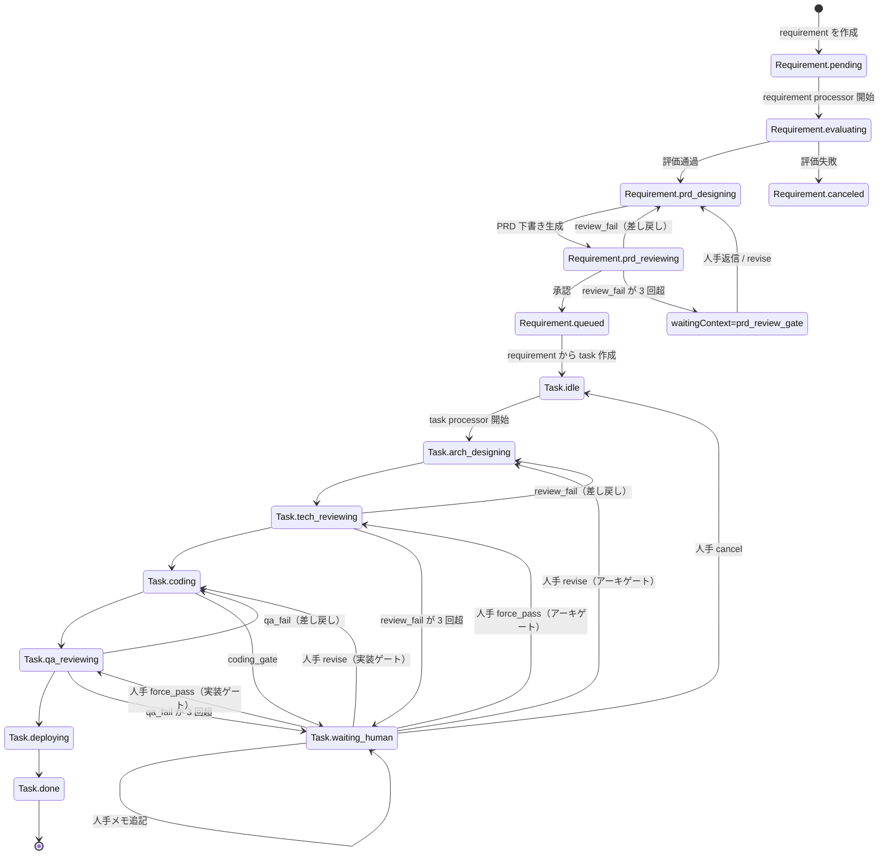

<div align="center">


# Senior

### 24/7で働くあなたのシニアエンジニアチーム

### 長期スパンのソフトウェアタスク向けデスクトップ AI マルチエージェント基盤

Senior は Electron ベースのデスクトップ AI マルチエージェント基盤で、要件入力を構造化 PRD に変換し、人手ゲート付きの段階的 AI 実行で長期スパンの開発タスクをオーケストレーションします。

要件評価、PRD 設計、技術レビュー、実装、QA、デプロイ手順まで、各ステージの成果物と実行履歴を追跡できます。

[](#インストール)
[](#仕組み)
[](#データと成果物)
[](#主な機能)

[インストール](#インストール) · [クイックスタート](#クイックスタート) · [仕組み](#仕組み) · [コントリビュート](#コントリビュート)

[コントリビュートガイド](../CONTRIBUTING.md) · [セキュリティポリシー](../SECURITY.md)

**[English](../README.md)** | **[简体中文](./README.zh-CN.md)** | **[繁體中文](./README.zh-TW.md)** | **[Español](./README.es.md)** | **[Deutsch](./README.de.md)** | **[Français](./README.fr.md)**

</div>

## スクリーンショット

<div align="center">
  
  
  
</div>

---

## なぜ Senior か

多くの AI ツールはチャットで止まります。Senior は長期スパンのソフトウェアデリバリーに向けた常時稼働のエンジニアリングチームとして、明示的なワークフロー状態機械を採用しています。

- 要件は明示的な状態で遷移: `pending -> evaluating -> prd_designing -> prd_reviewing -> queued/canceled`
- タスクは開発ステージで遷移: `idle -> arch_designing -> tech_reviewing -> coding -> qa_reviewing -> deploying -> done`
- 各ステージで成果物とトレースを保存し、何が起きたかを検証可能
- レビューゲートや修正時の Human-in-the-Loop を標準サポート

Senior は、単なるプロンプト応答ではなく、AI 実行とプロセス制御の両立を求めるチーム向けです。

---

## 主な機能

<table>
<tr>
<td width="50%">

### 要件パイプライン

要件妥当性の評価、PRD ドラフト生成、品質レビュー、実行可能タスクのキュー投入を自動化。

### タスクオーケストレーションループ

アーキ設計、技術レビュー、実装、QA レビュー、デプロイガイドを段階フローとして実行。

### Human-in-the-Loop ゲート

ステージが人間の文脈を必要とする場合、Senior は一時停止し、構造化返信後に再開。

</td>
<td width="50%">

### ステージトレースとタイムライン

各ステージ実行（ラウンド、所要時間、状態）と、詳細な agent/tool トレースを確認可能。

### 成果物レール

各ステージで成果物を永続化（例: `arch_design.md`, `tech_review.json`, `code.md`, `qa.json`, `deploy.md`）。

### ローカルファースト保存

プロジェクト情報、要件/タスク状態、ステージ実行履歴をローカル SQLite に保存し、スキーマは自動進化。

</td>
</tr>
</table>

### そのほか

- **2 系統の Auto Processor**（要件用・タスク用）
- **プロジェクトワークスペース連携**（選択ディレクトリで agent 実行）
- **バイリンガル UI**（`en-US` と `zh-CN`、設定はローカル保存）
- **Electron IPC 境界**（renderer と main サービスを分離）

---

## インストール

### 前提条件

- Node.js 20+（推奨）
- npm 10+
- Electron を実行できるデスクトップ環境
- Claude Agent SDK 実行用クレデンシャルのローカル設定

### ソースから実行

```bash
git clone https://github.com/zhihuiio/senior.git
cd senior
npm install
npm run dev
```

### ビルド

```bash
npm run build
npm run preview
```

---

## クイックスタート

1. `npm run dev` でアプリを起動。
2. プロジェクトディレクトリを作成または選択。
3. ワークスペースで要件を追加。
4. Requirement Auto Processor を開始し、評価と PRD 生成を実行。
5. キュー済みタスクを確認し、Task Auto Processor を開始。
6. ステージトレースと成果物を確認し、ゲート停止時に人手フィードバックを返す。

ヒント: 特定タスクを手動オーケストレーションし、タスクの human conversation へ直接返信することもできます。

---

## 仕組み

```text
┌─────────────────────────────────────────────────────────────────────┐
│                           Senior Desktop                            │
│  ┌───────────────┐   IPC   ┌─────────────────────────────────────┐  │
│  │ React Renderer│◄───────►│ Electron Main Services             │  │
│  │ (UI + State)  │         │ - project/requirement/task service │  │
│  └───────────────┘         │ - auto processors                  │  │
│                            │ - stage run + trace management     │  │
│                            └───────────────┬─────────────────────┘  │
│                                            │                        │
│                            ┌───────────────▼─────────────────────┐  │
│                            │ Claude Agent SDK                    │  │
│                            │ - requirement agents                │  │
│                            │ - task stage agents                 │  │
│                            └───────────────┬─────────────────────┘  │
│                                            │                        │
│                ┌───────────────────────────▼─────────────────────┐  │
│                │ Local data                                      │  │
│                │ - SQLite app.db (Electron userData)            │  │
│                │ - .senior/tasks/<taskId> artifacts              │  │
│                └─────────────────────────────────────────────────┘  │
└─────────────────────────────────────────────────────────────────────┘
```

### Requirement から Task への状態遷移



---

## プロジェクト構成

```text
src/
  main/                 Electron メインプロセス、サービス、DB、agents
  preload/              renderer 向け安全 API ブリッジ
  renderer/             React UI、hooks、i18n、コンポーネント
  shared/               共通型と IPC 契約
tests/
  main/agents/          agent 挙動テスト
resources/
  senior_v2.png         プロジェクト画像
```

---

## スクリプト

```bash
npm run dev                  # Electron + Vite の開発起動
npm run build                # main/preload/renderer をビルド
npm run preview              # ビルド済みアプリを確認
npm run test:freeform-agent  # freeform agent テスト実行
```

`npm install` 実行時には `postinstall` で `electron-rebuild -f -w better-sqlite3` も走ります。

---

## データと成果物

- SQLite DB: `<electron-userData>/app.db`
- タスク成果物ディレクトリ: `<project-path>/.senior/tasks/<taskId>/`
- 代表的なステージ成果物:
  - `arch_design.md`
  - `tech_review.json`
  - `code.md`
  - `qa.json`
  - `deploy.md`

Senior はステージ実行状態（`running/succeeded/failed/waiting_human`）、ラウンド情報、agent トレースを保存し、中断後の安全な修復と再開を可能にします。

---

## ロードマップ

- [x] 要件ステージパイプライン（評価、PRD 設計、レビュー）
- [x] レビューゲート付きタスクステージオーケストレーション
- [x] 要件/タスクの Auto Processor
- [x] ステージトレース永続化とタイムライン可視化
- [x] ワークスペース内タスク成果物の読み出し
- [ ] freeform agent 以外へのテスト拡張
- [ ] パッケージ配布とインストーラ整備
- [ ] 英語・簡体字中国語以外の UI 言語拡張

---

## コントリビュート

次の領域の貢献を歓迎します。

- ワークフロー信頼性とエッジケース対応
- 追加テストとフィクスチャ
- 追跡性と運用制御を高める UI/UX 改善
- 国際化とドキュメント品質向上

開発セットアップ:

```bash
npm install
npm run dev
```

---

## ライセンス

このプロジェクトは Senior Community License の下で提供されます。詳細は `LICENSE` を参照してください。
