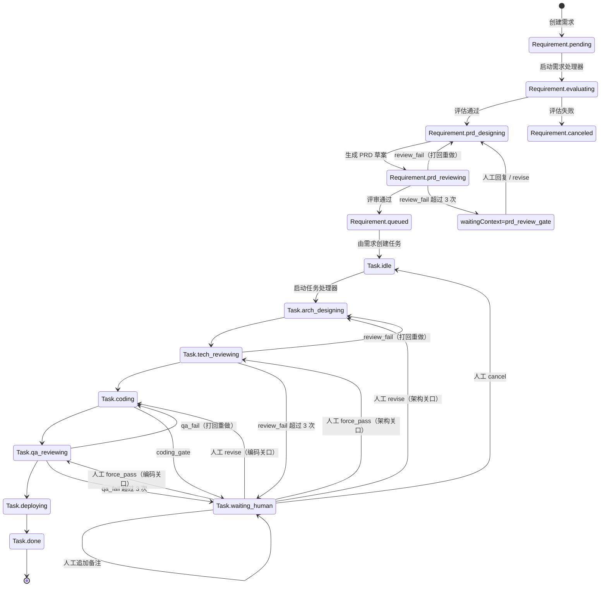

<div align="center">


# Senior

### 你的 7*24小时 资深工程师团队

### 为长程软件任务打造的桌面 AI 多智能体编排平台

Senior 是一个 Electron 桌面 AI 多智能体编排平台，可将需求输入转为结构化 PRD，并通过分阶段 AI 执行流程推进长程工程任务。

从需求评估到 PRD 设计、技术评审、编码、QA 与部署说明，Senior 为每个阶段提供可追溯的产物与运行记录。

[](#安装)
[](#工作原理)
[](#数据与产物)
[](#功能特性)

[安装](#安装) · [快速开始](#快速开始) · [工作原理](#工作原理) · [贡献](#贡献)

[贡献指南](../CONTRIBUTING.md) · [安全策略](../SECURITY.md)

**[English](../README.md)** | **[繁體中文](./README.zh-TW.md)** | **[Español](./README.es.md)** | **[Deutsch](./README.de.md)** | **[Français](./README.fr.md)** | **[日本語](./README.ja.md)**

</div>

## 截图

<div align="center">
  
  
  
</div>

---

## 为什么是 Senior？

多数 AI 工具停留在聊天层。Senior 被设计为你“始终在线”的工程团队，用流程状态机推进长程软件交付：

- 需求按明确状态流转：`pending -> evaluating -> prd_designing -> prd_reviewing -> queued/canceled`
- 任务按交付阶段流转：`idle -> arch_designing -> tech_reviewing -> coding -> qa_reviewing -> deploying -> done`
- 每个阶段都产出文件与 Trace，便于审计与复盘
- 人工介入是流程的一等能力，可在评审关口补充上下文

Senior 适合需要“AI 执行 + 流程控制”而非仅对话交互的团队。

---

## 功能特性

<table>
<tr>
<td width="50%">

### 需求流水线

自动完成需求合理性评估、PRD 草案生成、质量评审，并将可执行项入队为任务。

### 任务编排闭环

按阶段驱动执行架构设计、技术评审、编码实现、QA 评审与部署说明。

### Human-in-the-Loop 关口

当评审关口需要人工上下文时，流程暂停并支持结构化回复后继续执行。

</td>
<td width="50%">

### 阶段 Trace 与时间线

查看每个任务阶段的运行轮次、耗时、状态及详细 agent/tool Trace。

### 产物轨道

每个阶段都可落盘产物（如 `arch_design.md`、`tech_review.json`、`code.md`、`qa.json`、`deploy.md`）。

### 本地优先存储

项目元数据、需求/任务状态、阶段运行记录存于本地 SQLite，并支持自动 schema 演进。

</td>
</tr>
</table>

### 其他能力

- **双自动处理器**：需求自动处理与任务自动处理独立运行
- **项目目录绑定执行**：agent 在所选项目目录内运行
- **双语界面**：支持 `en-US` 与 `zh-CN`，语言偏好本地持久化
- **Electron IPC 边界**：渲染进程与主进程服务解耦

---

## 安装

### 前置要求

- Node.js 20+（推荐）
- npm 10+
- 可运行 Electron 的桌面环境
- 本地已配置 Claude Agent SDK 所需凭据

### 源码运行

```bash
git clone https://github.com/zhihuiio/senior.git
cd senior
npm install
npm run dev
```

### 构建

```bash
npm run build
npm run preview
```

---

## 快速开始

1. 使用 `npm run dev` 启动应用。
2. 创建或选择项目目录。
3. 在工作区新增需求。
4. 启动 Requirement Auto Processor，自动评估并生成 PRD。
5. 查看排队任务并启动 Task Auto Processor。
6. 在阶段 Trace 与产物面板中审查结果；遇到关口暂停时补充人工反馈。

提示：也可手动编排单个任务，并在任务人工对话流中直接回复。

---

## 工作原理

```text
┌─────────────────────────────────────────────────────────────────────┐
│                           Senior Desktop                            │
│  ┌───────────────┐   IPC   ┌─────────────────────────────────────┐  │
│  │ React Renderer│◄───────►│ Electron Main Services             │  │
│  │ (UI + State)  │         │ - project/requirement/task service │  │
│  └───────────────┘         │ - auto processors                  │  │
│                            │ - stage run + trace management     │  │
│                            └───────────────┬─────────────────────┘  │
│                                            │                        │
│                            ┌───────────────▼─────────────────────┐  │
│                            │ Claude Agent SDK                    │  │
│                            │ - requirement agents                │  │
│                            │ - task stage agents                 │  │
│                            └───────────────┬─────────────────────┘  │
│                                            │                        │
│                ┌───────────────────────────▼─────────────────────┐  │
│                │ Local data                                      │  │
│                │ - SQLite app.db (Electron userData)            │  │
│                │ - .senior/tasks/<taskId> artifacts              │  │
│                └─────────────────────────────────────────────────┘  │
└─────────────────────────────────────────────────────────────────────┘
```

### 需求到任务状态机



---

## 项目结构

```text
src/
  main/                 Electron 主进程、服务、数据库、agents
  preload/              渲染进程安全 API 桥
  renderer/             React UI、hooks、i18n、组件
  shared/               共享类型与 IPC 协议
tests/
  main/agents/          Agent 行为测试
resources/
  senior_v2.png         项目图片资源
```

---

## 脚本

```bash
npm run dev                  # 启动 Electron + Vite 开发环境
npm run build                # 构建 main/preload/renderer
npm run preview              # 预览构建产物
npm run test:freeform-agent  # 运行 freeform agent 测试
```

`npm install` 会通过 `postinstall` 自动执行 `electron-rebuild -f -w better-sqlite3`。

---

## 数据与产物

- SQLite 数据库路径：`<electron-userData>/app.db`
- 任务产物目录：`<project-path>/.senior/tasks/<taskId>/`
- 常见阶段产物：
  - `arch_design.md`
  - `tech_review.json`
  - `code.md`
  - `qa.json`
  - `deploy.md`

Senior 会持久化阶段运行状态（`running/succeeded/failed/waiting_human`）、轮次元信息与 agent Trace，以便中断后安全修复与恢复。

---

## 路线图

- [x] 需求阶段流水线（评估、PRD 设计、评审）
- [x] 含评审关口的任务阶段编排
- [x] 需求与任务双自动处理器
- [x] 阶段 Trace 持久化与时间线可视化
- [x] 任务目录产物读取
- [ ] 扩展 freeform-agent 之外的测试覆盖
- [ ] 打包发布流程与安装包产物
- [ ] 支持更多 UI 语言（超出英文/简体中文）

---

## 贡献

欢迎贡献，重点方向：

- 流程稳定性与边界场景处理
- 更多测试与测试数据
- 可追溯性与操作控制相关的 UI/UX 改进
- 国际化与文档质量提升

开发启动：

```bash
npm install
npm run dev
```

---

## 许可证

本项目采用 Senior Community License 许可。详情见 `LICENSE` 文件。
