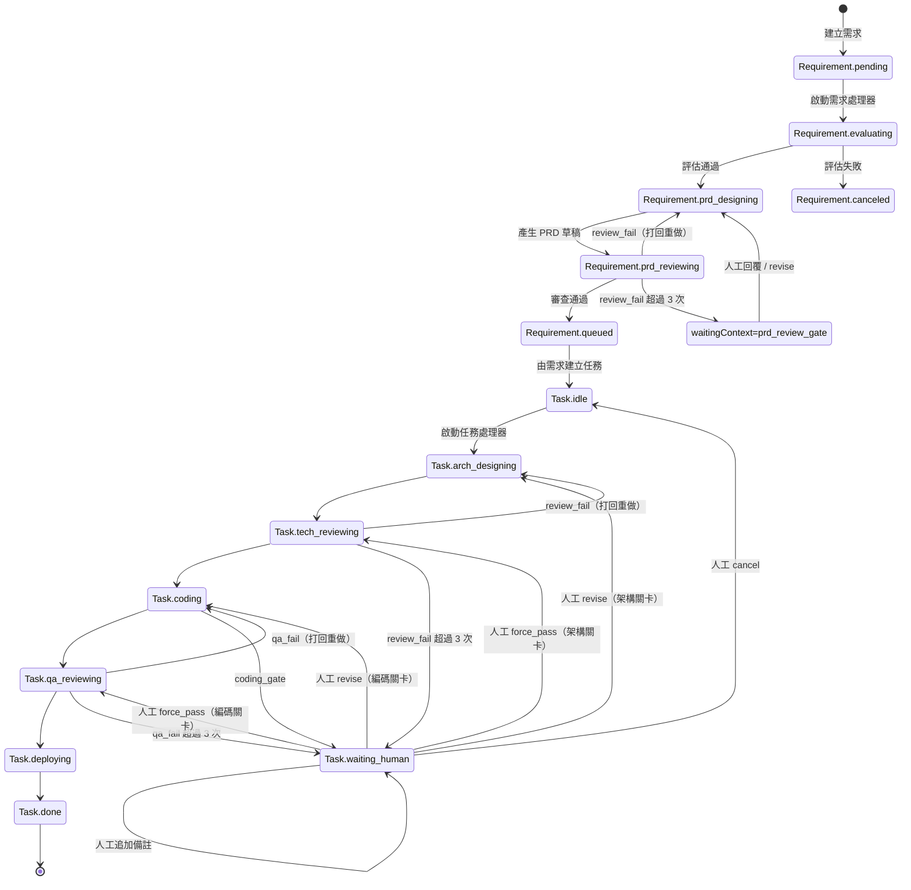

<div align="center">


# Senior

### 你的 7*24小時 資深工程師團隊

### 為長程軟體任務打造的桌面 AI 多智能體編排平台

Senior 是一個 Electron 桌面 AI 多智能體編排平台，可將需求輸入轉為結構化 PRD，並以分階段 AI 流程推進長程工程任務。

從需求評估、PRD 設計、技術審查、編碼、QA 到部署說明，Senior 讓每個階段都有可追溯的產物與執行紀錄。

[](#安裝)
[](#運作原理)
[](#資料與產物)
[](#功能特色)

[安裝](#安裝) · [快速開始](#快速開始) · [運作原理](#運作原理) · [貢獻](#貢獻)

**[English](../README.md)** | **[简体中文](./README.zh-CN.md)** | **[Español](./README.es.md)** | **[Deutsch](./README.de.md)** | **[Français](./README.fr.md)** | **[日本語](./README.ja.md)**

</div>

---

<div align="center">


</div>

---

## 截圖

<div align="center">
  
  
  
</div>

---

## 為什麼選 Senior？

多數 AI 工具停留在聊天層。Senior 被設計為你「始終在線」的工程團隊，用流程狀態機推進長程軟體交付：

- 需求以明確狀態流轉：`pending -> evaluating -> prd_designing -> prd_reviewing -> queued/canceled`
- 任務以交付階段流轉：`idle -> arch_designing -> tech_reviewing -> coding -> qa_reviewing -> deploying -> done`
- 每個階段都會留下產物與 Trace，利於稽核與回溯
- 人工介入是流程的一等能力，可在審查關卡補充上下文

Senior 適合需要「AI 執行 + 流程控制」而不只是對話互動的團隊。

---

## 功能特色

<table>
<tr>
<td width="50%">

### 需求管線
自動完成需求合理性評估、PRD 草稿生成、品質審查，並將可執行項目排入任務佇列。

### 任務編排迴圈
以階段驅動方式執行架構設計、技術審查、編碼、QA 審查與部署指引。

### Human-in-the-Loop 關卡
當審查關卡需要人工上下文時，流程會暫停，支援結構化回覆後再繼續執行。

</td>
<td width="50%">

### 階段 Trace 與時間軸
檢視每個任務階段的執行輪次、耗時、狀態與詳細 agent/tool Trace。

### 產物軌
每個階段都可落地保存產物（例如 `arch_design.md`、`tech_review.json`、`code.md`、`qa.json`、`deploy.md`）。

### 本地優先儲存
專案資料、需求/任務狀態與階段執行紀錄儲存在本地 SQLite，並支援自動 schema 演進。

</td>
</tr>
</table>

### 其他能力

- **雙自動處理器**：需求自動處理與任務自動處理可獨立運作
- **專案目錄綁定執行**：agent 在所選專案路徑中執行
- **雙語介面**：支援 `en-US` 與 `zh-CN`，語言偏好會本地保存
- **Electron IPC 邊界**：渲染進程與主進程服務分離

---

## 安裝

### 前置需求

- Node.js 20+（建議）
- npm 10+
- 可運行 Electron 的桌面環境
- 本機已配置 Claude Agent SDK 所需憑證

### 從原始碼執行

```bash
git clone https://github.com/zhihuiio/senior.git
cd senior
npm install
npm run dev
```

### 建置

```bash
npm run build
npm run preview
```

---

## 快速開始

1. 使用 `npm run dev` 啟動應用。
2. 建立或選擇專案目錄。
3. 在工作區新增需求。
4. 啟動 Requirement Auto Processor，自動評估並生成 PRD。
5. 檢視排隊任務並啟動 Task Auto Processor。
6. 在階段 Trace 與產物面板審查結果；遇到關卡暫停時補充人工回覆。

提示：也可手動編排特定任務，並在任務人工對話流程中直接回覆。

---

## 運作原理

```text
┌─────────────────────────────────────────────────────────────────────┐
│                           Senior Desktop                            │
│  ┌───────────────┐   IPC   ┌─────────────────────────────────────┐  │
│  │ React Renderer│◄───────►│ Electron Main Services             │  │
│  │ (UI + State)  │         │ - project/requirement/task service │  │
│  └───────────────┘         │ - auto processors                  │  │
│                            │ - stage run + trace management     │  │
│                            └───────────────┬─────────────────────┘  │
│                                            │                        │
│                            ┌───────────────▼─────────────────────┐  │
│                            │ Claude Agent SDK                    │  │
│                            │ - requirement agents                │  │
│                            │ - task stage agents                 │  │
│                            └───────────────┬─────────────────────┘  │
│                                            │                        │
│                ┌───────────────────────────▼─────────────────────┐  │
│                │ Local data                                      │  │
│                │ - SQLite app.db (Electron userData)            │  │
│                │ - .senior/tasks/<taskId> artifacts              │  │
│                └─────────────────────────────────────────────────┘  │
└─────────────────────────────────────────────────────────────────────┘
```

### 需求到任務狀態機



---

## 專案結構

```text
src/
  main/                 Electron 主進程、服務、資料庫、agents
  preload/              渲染進程安全 API 橋接
  renderer/             React UI、hooks、i18n、元件
  shared/               共用型別與 IPC 協議
tests/
  main/agents/          Agent 行為測試
resources/
  senior_v2.png         專案圖片資源
```

---

## 腳本

```bash
npm run dev                  # 啟動 Electron + Vite 開發環境
npm run build                # 建置 main/preload/renderer
npm run preview              # 預覽建置結果
npm run test:freeform-agent  # 執行 freeform agent 測試
```

`npm install` 會透過 `postinstall` 自動執行 `electron-rebuild -f -w better-sqlite3`。

---

## 資料與產物

- SQLite 資料庫路徑：`<electron-userData>/app.db`
- 任務產物路徑：`<project-path>/.senior/tasks/<taskId>/`
- 常見階段產物：
  - `arch_design.md`
  - `tech_review.json`
  - `code.md`
  - `qa.json`
  - `deploy.md`

Senior 會持久化階段狀態（`running/succeeded/failed/waiting_human`）、輪次中繼資料與 agent Trace，確保中斷後可安全修復與恢復。

---

## 路線圖

- [x] 需求階段管線（評估、PRD 設計、審查）
- [x] 含審查關卡的任務階段編排
- [x] 需求與任務雙自動處理器
- [x] 階段 Trace 持久化與時間軸視覺化
- [x] 任務目錄產物讀取
- [ ] 擴充 freeform-agent 以外的測試覆蓋
- [ ] 打包發佈流程與安裝檔產物
- [ ] 擴充更多 UI 語言（超出英文/簡體中文）

---

## 貢獻

歡迎貢獻，特別是以下方向：

- 流程穩定性與邊界場景處理
- 更多測試與測試資料
- 可追溯性與操作控制相關的 UI/UX 改進
- 國際化與文件品質提升

開發啟動：

```bash
npm install
npm run dev
```

---

## 授權

本專案採用 Senior Community License 授權。詳情請參見 `LICENSE` 檔案。
